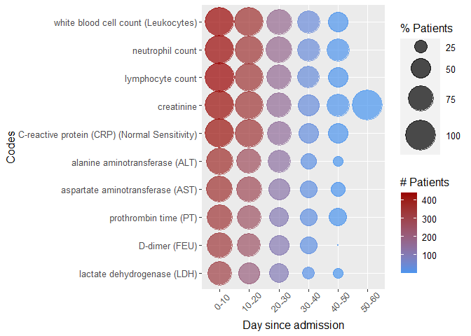
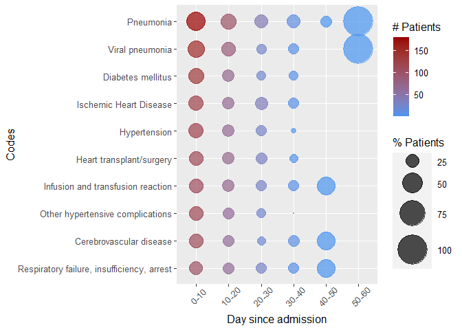
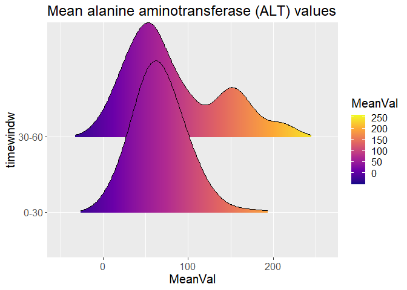
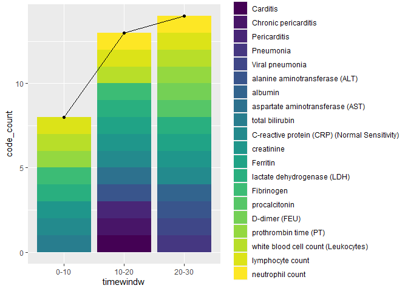

<!-- README.md is generated from README.Rmd. Please edit that file -->

# PostSequelae

<!-- badges: start -->
<!-- badges: end -->

The goal of PostSequelae is to provide data analysis for 4CE V2.1 covid
data and generate bubble plot and density plot for the count data and
continous lab data, respectively.

## Installation

You can install the development version from
[GitHub](https://github.com/) with:

``` r
# install.packages("devtools")
devtools::install_github("xinxiong0238/PostSequelae")
```

## Example

This is a basic example which shows you how to solve a common problem:

``` r
library(PostSequelae)

windows.min <- 0
windows.max <- 120
windows.size.bubble <- 10
windows.size.density = 30
filter.topn <- 10

data = main(PatientSummary, PatientObservations,
            PheCodes, loinc_mapping, digits = NULL,
            windows.size.bubble, windows.size.density,
            windows.min, windows.max,
            topn = filter.topn)

data$bubble$LAB[[1]]
```



``` r
data$bubble$ICD[[1]]
```



``` r
data$density$`1742-6`
#> Picking joint bandwidth of 17
```



``` r
patient.plot <- patientlevelplot(data$data$PatientObersvations_pro, patient_num_id = 1)
patient.plot
```


